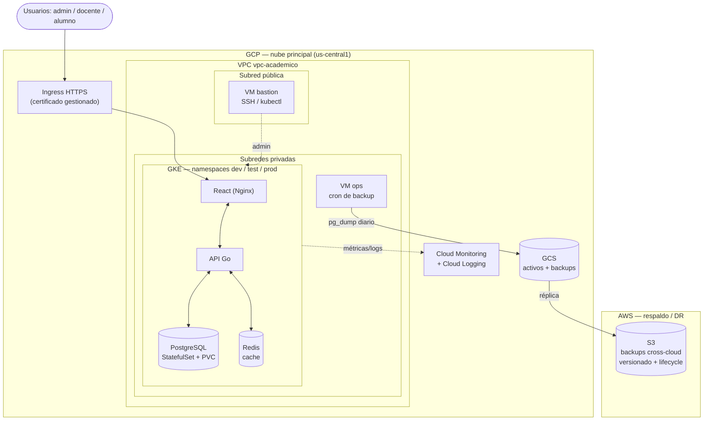
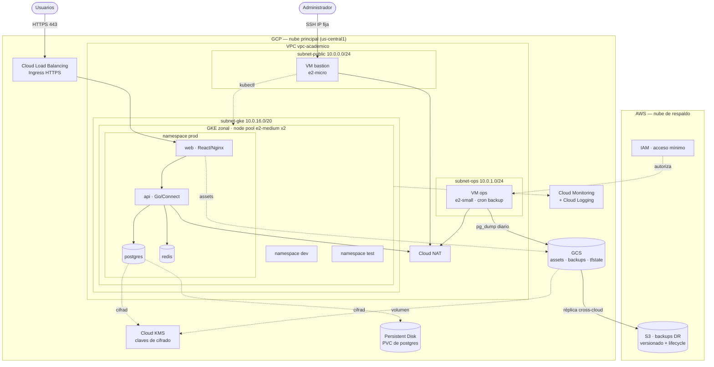
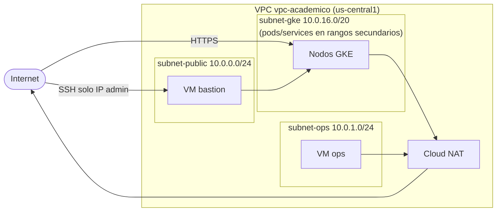
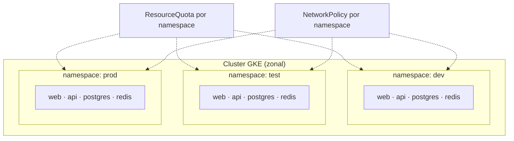
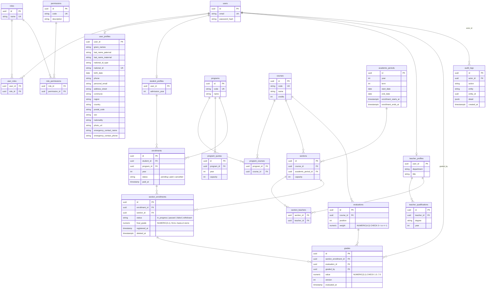
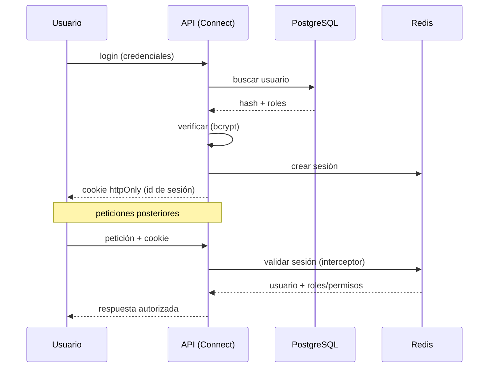
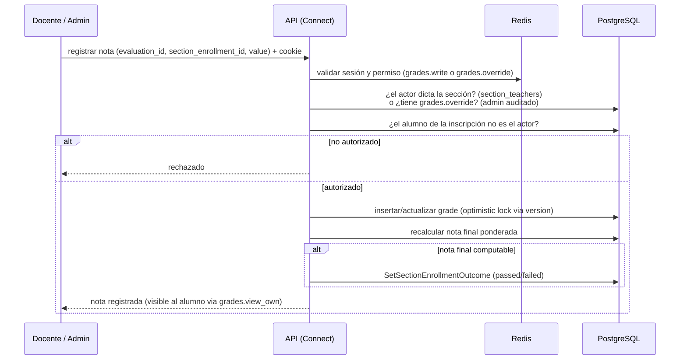
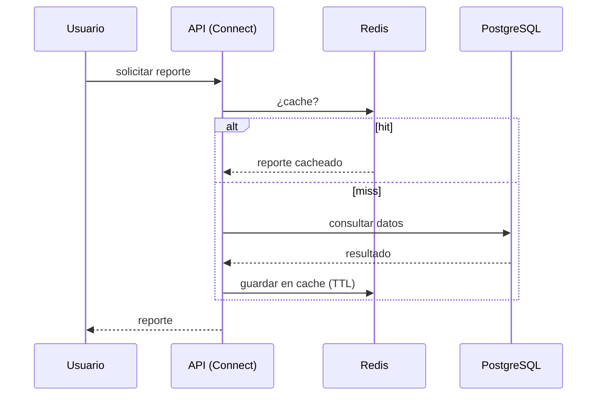
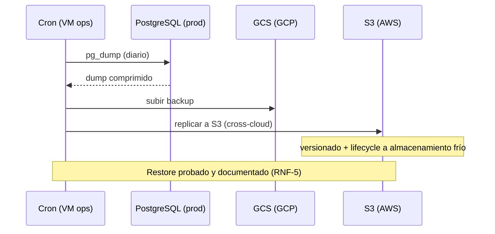

# Arquitectura — Sistema de gestión académica

## 1. Caso y contexto

Un instituto profesional necesita llevar a la nube su sistema de **matrículas, notas y reportes**. Las exigencias del negocio son alta seguridad, trazabilidad de accesos y cambios, y presupuesto limitado.

La solución se despliega en **dos nubes públicas**:

- **GCP (principal):** ejecuta toda la aplicación sobre Kubernetes gestionado (GKE).
- **AWS (respaldo/DR):** almacena los backups fuera de la nube principal para recuperación ante desastres.

## 2. Requisitos

### 2.1 Funcionales

| ID   | Requisito                                                             |
| ---- | --------------------------------------------------------------------- |
| RF-1 | Gestión de matrículas (alta, baja, consulta de inscripciones).        |
| RF-2 | Registro y consulta de notas por alumno y asignatura.                 |
| RF-3 | Generación de reportes académicos.                                    |
| RF-4 | Autenticación y autorización por rol: administrador, docente, alumno. |
| RF-5 | Auditoría de accesos y cambios de configuración.                      |

### 2.2 No funcionales

| ID    | Requisito                                                   | Cómo se cumple                                                              |
| ----- | ----------------------------------------------------------- | --------------------------------------------------------------------------- |
| RNF-1 | Separación de ambientes dev/test/prod en la nube principal. | Namespaces aislados en GKE + ResourceQuotas + NetworkPolicies.              |
| RNF-2 | Cifrado en tránsito.                                        | TLS en Ingress (certificado gestionado), tráfico interno por red privada.   |
| RNF-3 | Cifrado en reposo.                                          | Discos GCE y buckets GCS/S3 cifrados (claves gestionadas).                  |
| RNF-4 | Logging central para auditoría.                             | Cloud Logging recibe logs de acceso y de actividad administrativa.          |
| RNF-5 | Backups diarios + prueba de restauración documentada.       | `pg_dump` diario → GCS → réplica a S3; restore probado y documentado.       |
| RNF-6 | Acceso administrativo controlado.                           | Único punto de entrada SSH/kubectl vía bastión; nodos en subredes privadas. |

### 2.3 SLA objetivo

| Métrica                             | Objetivo (producción) |
| ----------------------------------- | --------------------- |
| Disponibilidad                      | 99.5 % mensual        |
| RPO (pérdida máxima de datos)       | 24 h (backup diario)  |
| RTO (tiempo máximo de recuperación) | 4 h                   |

## 3. Diagrama lógico (multi-cloud)



## 4. Diagrama integral de infraestructura cloud

Vista completa de punta a punta: ambas nubes, red, cómputo, almacenamiento, observabilidad, cifrado y el flujo de respaldo.



## 5. Servicios por nube

### GCP (principal)

| Servicio                   | Uso                                                                                                                                         |
| -------------------------- | ------------------------------------------------------------------------------------------------------------------------------------------- |
| GKE                        | Cluster Kubernetes que orquesta los contenedores.                                                                                           |
| Compute Engine (GCE)       | VM `bastion` (acceso) y VM `ops` (backups). Nodos del cluster.                                                                              |
| VPC + subredes             | Red privada segmentada (pública para bastión, privadas para cargas).                                                                        |
| Cloud NAT                  | Salida a internet de las subredes privadas.                                                                                                 |
| Persistent Disk            | Volúmenes persistentes (PVC) de PostgreSQL.                                                                                                 |
| Cloud Storage (GCS)        | Activos estáticos, backups y estado de Terraform.                                                                                           |
| Cloud Load Balancing       | Expone la aplicación vía Ingress HTTPS.                                                                                                     |
| Cloud Monitoring + Logging | Métricas, dashboards, alertas y logs de auditoría.                                                                                          |
| Cloud KMS                  | Claves de cifrado en reposo (CMEK donde aplique).                                                                                           |

### AWS (respaldo / DR)

| Servicio | Uso                                                                                |
| -------- | ---------------------------------------------------------------------------------- |
| S3       | Destino de los backups cross-cloud (versionado + lifecycle a almacenamiento frío). |
| IAM      | Credencial de acceso mínimo para que la VM `ops` escriba en el bucket.             |

## 6. Modelos de servicio

| Modelo   | Componentes                                                      | Por qué                                                                                                           |
| -------- | ---------------------------------------------------------------- | ----------------------------------------------------------------------------------------------------------------- |
| **IaaS** | VMs `bastion` y `ops`, VPC, subredes, firewall.                  | Necesitamos control total de la red y del punto de acceso administrativo.                                         |
| **PaaS** | GKE (plano de control gestionado), Cloud Monitoring/Logging, S3. | Google/AWS operan el plano de control; nos enfocamos en la app, no en parchear masters ni servidores de métricas. |
| **SaaS** | —                                                                | No se usan SaaS de negocio; el sistema académico es propio.                                                       |

**Decisión clave:** GKE en lugar de un cluster autogestionado sobre VMs. El plano de control gestionado elimina el trabajo de operar y parchear los masters, reduce errores y libera tiempo para seguridad y observabilidad, que es donde el caso pone el foco. El costo del plano de control se evita usando un cluster zonal (gratis en el primer cluster por cuenta).

## 7. Modelo de despliegue

El despliegue es **nube pública multi-cloud**, no híbrido.

- **Híbrido** implica combinar nube pública con infraestructura privada/on-premise. No es el caso: no hay datacenter propio.
- Lo nuestro es **multi-cloud**: dos nubes públicas (GCP principal + AWS para DR).

**Por qué multi-cloud y no una sola nube:** el caso exige backups fuera de la nube principal para recuperación ante desastres. Guardar el respaldo en otra nube protege contra una falla total de cuenta o región del proveedor principal, que un backup en la misma nube no cubre. AWS S3 aporta almacenamiento de objetos barato, durable y con versionado, suficiente para el rol de respaldo sin sumar complejidad operativa.

## 8. Red y seguridad

### 8.1 Topología de red



### 8.2 Plan de direccionamiento (CIDR)

| Rango                     | CIDR           | Uso                       |
| ------------------------- | -------------- | ------------------------- |
| subnet-public             | `10.0.0.0/24`  | VM bastión                |
| subnet-ops                | `10.0.1.0/24`  | VM ops                    |
| subnet-gke (nodos)        | `10.0.16.0/20` | Nodos del cluster         |
| Rango secundario pods     | `10.4.0.0/14`  | IPs de pods               |
| Rango secundario services | `10.8.0.0/20`  | ClusterIP de los Services |

Los rangos de pods y services se definen como rangos secundarios de la subred de GKE (IP aliasing), práctica nativa de GKE para asignar IPs enrutables a pods sin NAT interno.

### 8.3 Matriz de flujos de red

| Origen           | Destino            | Puerto    | Propósito                  |
| ---------------- | ------------------ | --------- | -------------------------- |
| Internet (admin) | bastión            | 22        | SSH administrativo         |
| Internet         | Load Balancer      | 443       | Acceso HTTPS a la app      |
| Load Balancer    | pods web/api       | 80 / 8080 | Tráfico de aplicación      |
| api              | postgres           | 5432      | Acceso a datos             |
| api              | redis              | 6379      | Sesiones y cache           |
| bastión          | API server de GKE  | 443       | `kubectl`                  |
| nodos / ops      | Internet (vía NAT) | 443       | Egress: imágenes, APIs, S3 |

### 8.4 Controles de seguridad

| Control                     | Implementación                                                                                |
| --------------------------- | --------------------------------------------------------------------------------------------- |
| Acceso administrativo       | SSH solo al bastión, restringido a la IP del administrador. Nodos y VM `ops` sin IP pública.  |
| Reglas de firewall          | Mínimo necesario: SSH al bastión, HTTPS al Ingress, tráfico interno explícito entre subredes. |
| Aislamiento entre ambientes | NetworkPolicies por namespace: dev/test no pueden alcanzar la base de prod.                   |
| Cifrado en tránsito         | TLS en el Ingress; tráfico entre pods dentro de la red privada del cluster.                   |
| Cifrado en reposo           | Discos persistentes y buckets cifrados; claves en Cloud KMS donde se requiera CMEK.           |
| Secretos                    | Kubernetes Secrets por namespace; credenciales de AWS solo en la VM `ops`.                    |
| Auditoría                   | Cloud Logging centraliza logs de acceso y de actividad administrativa (RNF-4).                |

### 8.5 Roles, permisos y pertenencia

La autorización es de dos capas: **permiso** (qué operación, data-driven) y **pertenencia a nivel de recurso** (sobre qué datos). Los permisos se guardan en tablas (`permissions`, `role_permissions`) y se asignan vía `user_roles`. El control real es del backend; la UI solo oculta lo que el rol no puede usar.

El sistema cuenta con **13 permisos** definidos como constantes tipadas en `internal/authz/permission.go` y validados por un test de paridad contra las migraciones seed.

| Operación                                              | Administrador |      Docente       | Alumno |
| ------------------------------------------------------ | :-----------: | :----------------: | :----: |
| Gestionar usuarios, roles y permisos                   |      Sí       |         —          |   —    |
| Gestionar catálogo (programas, asignaturas, secciones) |      Sí       |         —          |   —    |
| Gestionar matrícula (anual)                            |      Sí       |         —          |   —    |
| Inscribir sección (auto-inscripción, ventana abierta)  |      Sí       |         —          |   Sí   |
| Anular inscripción de sección                          |      Sí       |         —          |   —    |
| Ver inscripciones de sección propias                   |      Sí       |         —          |   Sí   |
| Ver perfil propio                                      |      Sí       |         Sí         |   Sí   |
| Ver matrícula e inscripciones propias                  |      Sí       |         —          |   Sí   |
| Registrar / editar notas                               |      Sí       | Solo sus secciones |   —    |
| Ver notas de una sección                               |      Sí       | Solo sus secciones |   —    |
| Ver notas propias                                      |      Sí       |         —          |   Sí   |
| Generar reportes                                       |      Sí       | Solo sus secciones |   —    |
| Ver logs de auditoría                                  |      Sí       |         —          |   —    |

**Dos capas de autorización:**

- El **permiso** habilita la operación (el interceptor lo verifica contra los permisos del rol); la **pertenencia** decide sobre qué recursos. Un docente con permiso para cargar notas solo puede hacerlo en las secciones que dicta (`section_teachers`). La misma pertenencia limita la **lectura** de notas (`grades.read`): los listados fuera de las secciones del docente devuelven vacío y las consultas por id responden not-found, sin revelar la existencia del recurso (patrón anti-leak, igual que en perfiles e inscripciones).
- **Perfil propio:** todo usuario puede leer sus propios datos personales (operación habilitada por el permiso `profile.view_own`). La pertenencia restringe la lectura al registro cuyo `user_id` coincide con el del solicitante; un usuario nunca ve el perfil de otro por esta vía. La gestión de perfiles de terceros (alta/edición/lectura por id) es una operación administrativa aparte (`users.manage`).
- **Auto-inscripción vs. administración:** el alumno puede inscribirse a secciones dentro de la ventana habilitada (`sections.enroll`) y consultar sus propias inscripciones (`section_enrollment.view_own`). La anulación de inscripciones es exclusivamente administrativa; no existe WithdrawOwnSection.
- **Sin auto-acción:** nadie opera sobre sus propios registros académicos. Un docente que también es alumno no puede cargar ni editar la nota de una inscripción donde el alumno sea él mismo. Esta regla aplica a los registros académicos (notas, inscripciones), no a la lectura de los datos personales propios.
- **Admin total, pero auditado:** el administrador puede todo —incluida la corrección de una nota—, pero cada acción queda registrada en `audit_logs`. El poder no exime del rastro.

Regla de autorización para cargar o editar una nota (sobre la inscripción `SE`):

```text
permitir si:
  el rol incluye el permiso grades.write
    AND existe section_teachers(section = SE.section_id, teacher = user)  -- dicta la sección
    AND SE.student_id != user                                             -- no califica su propio registro
  OR el rol incluye el permiso grades.override                            -- admin; queda auditado
```

## 9. Ambientes

Tres ambientes en un **único cluster GKE**, separados por namespace:



Un solo cluster mantiene el costo bajo (un único plano de control). El aislamiento es lógico, reforzado con ResourceQuotas (que dev no consuma recursos de prod) y NetworkPolicies (que los ambientes no se alcancen entre sí).

## 10. Modelo de datos

Entidades del dominio académico. Los nombres de tablas y columnas siguen la convención del código (inglés). La identidad y la autenticación viven en `users`; los datos de cada rol, en perfiles; y el control de acceso es data-driven (roles y permisos en tablas).



Notas del modelo:

- **Identidad, roles y permisos:** `users` es solo identidad/auth. El acceso es data-driven: `roles` y `permissions` se relacionan vía `role_permissions` (M:N) y se asignan a usuarios vía `user_roles` (M:N) — una persona puede ser docente **y** alumno a la vez, y los permisos de cada rol se cambian sin tocar código.
- **Datos personales:** los datos personales comunes a cualquier persona (nombre, identificador legal, contacto, domicilio) viven en `user_profiles` (1:1 con `users`), no en `users` —que se mantiene magro para autenticación— ni duplicados en `student_profiles`/`teacher_profiles`. Los perfiles de rol (`student_profiles`, `teacher_profiles`) guardan solo atributos específicos del rol. `national_id` es único. Cada usuario puede leer su propio `user_profiles` vía `profile.view_own` (ver §8.5).
- **Jerarquía académica:** `programs` ↔ `courses` es **M:N** (`program_courses`): una asignatura como "Inglés I" puede compartirse entre varias carreras. Cada `course` se dicta en `sections` (una sección = asignatura + `academic_period` + uno o varios docentes vía `section_teachers`, co-docencia).
- **Períodos lectivos:** `academic_periods` usa `term ∈ {1, 2}` (dos semestres por año), con `UNIQUE(year, term)`. Las columnas `enrollment_starts_at` / `enrollment_ends_at` definen la ventana institucional de auto-inscripción evaluada con el reloj del servidor de base de datos; `NULL` equivale a ventana no configurada (fail-closed). `program_quotas` lleva metadata de auditoría y soft-delete (es una entidad mutable sensible, no append-only) y tiene `UNIQUE(program_id, year)`.
- **Matrícula vs inscripción:** `enrollments` es la matrícula anual por carrera (`program_id` + `year`), con `UNIQUE(student_id, program_id, year)`. `section_enrollments` son las inscripciones a secciones, con unicidad por índice parcial `UNIQUE(enrollment_id, section_id) WHERE deleted_at IS NULL` (filas soft-deleted no bloquean una re-inscripción), y solo existen si hay matrícula vigente. Las notas (`grades`) cuelgan de la inscripción a la sección a través de la evaluación.
- **Máquina de estados de `section_enrollments`:** `in_progress → withdrawn` (admin); `in_progress → passed | failed` (slice de notas vía `SetSectionEnrollmentOutcome`). `passed` y `failed` son estados terminales; no existe WithdrawOwnSection.
- **Modelo de notas:** `evaluations` define el esquema de evaluación **por asignatura** (`course_id`): los instrumentos los fija el estándar curricular, no el docente de cada sección. Las evaluaciones no llevan nombre; se identifican por `position` (1..N, asignada por el servidor según el orden de creación), lo que elimina duplicados y errores de tipeo. Los pesos individuales cumplen `0 < w <= 1` y la suma del esquema es exactamente 1.0, validada en la creación. El esquema es **inmutable**: la única corrección posible es la recreación administrativa completa (`grades.override`), permitida solo mientras ninguna evaluación tenga notas registradas (unicidad por índice parcial `UNIQUE(course_id, position) WHERE deleted_at IS NULL`). `grades` registra una nota por instrumento por inscripción (`UNIQUE(evaluation_id, section_enrollment_id)`) en escala 1.0–7.0 (`NUMERIC(3,1)`); las notas no se anulan ni se eliminan — las correcciones solo actualizan el valor bajo optimistic locking (`version`), y **todo cambio de valor queda registrado en `audit_logs`** (actor, valor anterior y nuevo). La nota final es la suma ponderada calculada con aritmética decimal exacta, redondeada half-up a 1 decimal; cuando todas las evaluaciones del esquema tienen nota, ≥ 4.0 → `passed`, < 4.0 → `failed`, y el valor se persiste en `section_enrollments.final_grade` — ambos escritos exclusivamente por `SetSectionEnrollmentOutcome` en la misma transacción que la nota. Las notas registradas son visibles al alumno de inmediato mediante `grades.view_own` (la respuesta al alumno no expone `graded_by`); no existe paso de publicación. `graded_by` referencia `users(id)` —no `teacher_profiles`— para auditar cualquier actor autorizado (docente vía `section_teachers` o admin vía `grades.override`) sin requerir filas fantasma en `teacher_profiles`.
- **Cupos:** `program_quotas` fija el cupo de admisión por `(carrera, año)` (ej. 40 matrículas); `sections.capacity`, el cupo de cada sección. Ambos se controlan con bloqueo de fila para evitar sobreventa en el pico de inscripción (ver §12).
- **Pertenencia:** `section_teachers` define qué docentes dictan cada sección. Es la base de la autorización por pertenencia (ver §8.5).
- `audit_logs` da soporte a la trazabilidad (RF-5): tabla append-only (`actor_id`, `action`, `entity`, `entity_id`, `detail` JSONB) que registra los cambios de valores sensibles — entre ellos, toda corrección u override de nota. Los reportes (RF-3) se generan por consulta y se cachean en Redis; no requieren tabla propia.

### 10.1 Convención de metadata y auditoría

Para no repetir columnas en el diagrama, estas se aplican por convención:

| Campo                       | Qué                            | Dónde                                                                                                                                                    |
| --------------------------- | ------------------------------ | -------------------------------------------------------------------------------------------------------------------------------------------------------- |
| `created_at` / `updated_at` | Cuándo se creó / modificó      | Entidades mutables (users, perfiles, programs, courses, academic_periods, sections, program_quotas, enrollments, section_enrollments, evaluations, grades). |
| `created_by` / `updated_by` | Quién (FK a users)             | Cambios humanos sensibles: users, perfiles, programs, courses, sections, program_quotas, grades, enrollments. `section_enrollments` excluida (no está en la lista de cambios sensibles).    |
| `deleted_at`                | Soft-delete (`NULL` = vivo)    | Registros que no se borran físicamente: users, programs, courses, academic_periods, sections, program_quotas, enrollments, section_enrollments, evaluations, grades. |
| `version`                   | Optimistic locking             | `grades` (edición concurrente, evita pisar cambios).                                                                                                     |
| `status`                    | Estado de negocio multi-estado | `enrollments` y `section_enrollments` (ya en el diagrama).                                                                                               |

Las tablas **append-only** (`audit_logs`, `user_roles`, `role_permissions`, `program_courses`, `section_teachers`) solo llevan `created_at`: no se editan, se insertan o se borran.

## 11. Flujos clave

### 11.1 Autenticación



### 11.2 Inscripción de sección (con matrícula vigente)

El camino de inscripción distingue dos actores con reglas distintas. El alumno requiere ventana de inscripción abierta; el admin no está restringido por la ventana y puede revivir inscripciones anuladas.

```mermaid
sequenceDiagram
    participant U as Alumno / Admin
    participant A as API (Connect interceptor)
    participant R as Redis
    participant P as PostgreSQL

    U->>A: EnrollOwnSection / EnrollSection + cookie
    A->>A: semáforo de admisión (cap = floor(pool*0.6))<br/>saturado → ResourceExhausted (sin abrir conexión DB)
    A->>R: validar sesión y permiso
    A->>P: COUNT activos (pre-check sin lock; sección llena → rechazado)
    A->>P: BEGIN; SET LOCAL lock_timeout='2500ms'
    A->>P: SELECT … FROM sections FOR UPDATE<br/>(obtiene capacity, course_id, ventana DB-clock)
    alt alumno y ventana cerrada o NULL
        A-->>U: FailedPrecondition (window closed)
    end
    A->>P: verificar enrollment status=paid, año y curso en programa
    alt no cumple gate
        A-->>U: FailedPrecondition
    end
    A->>P: COUNT activos bajo el lock (check autoritativo)
    alt sección llena
        A-->>U: FailedPrecondition (section full)
    else hay cupo
        A->>P: INSERT section_enrollment (o UPDATE revival admin)
        A->>P: COMMIT
        A-->>U: inscripción creada
    end
```

### 11.3 Carga de nota (con verificación de pertenencia)



### 11.4 Generación de reporte (con cache)



## 12. Concurrencia y cupos

El período de inscripción concentra un volumen alto de peticiones sobre recursos acotados (el cupo de cada carrera y el de cada sección). Son dos problemas distintos, en capas distintas.

### 12.1 Condición de carrera por los cupos

El control ingenuo (contar inscripciones y, si hay lugar, insertar) no es atómico: entre el conteo y la inserción, otras peticiones inscriben y se supera el cupo. Un bloqueo en memoria (un mutex o el paquete `sync` de Go) no resuelve el caso, porque solo coordina dentro de un proceso y, al ejecutarse varias réplicas de la API, cada una mantiene su propio bloqueo. El bloqueo debe residir en el recurso compartido —PostgreSQL— mediante `SELECT ... FOR UPDATE`:

```sql
BEGIN;
-- cupo de carrera (matrícula); el mismo patrón aplica a sections.capacity
SELECT capacity FROM program_quotas WHERE program_id = $1 AND year = $2 FOR UPDATE;
SELECT count(*) FROM enrollments
  WHERE program_id = $1 AND year = $2 AND status <> 'cancelled';
-- si count < capacity: insertar; en caso contrario, rechazar
COMMIT;
```

El bloqueo de fila serializa los intentos sobre un mismo cupo, mientras que cupos distintos no se bloquean entre sí, lo que preserva el rendimiento. La restricción `UNIQUE(student_id, program_id, year)` en `enrollments` y el índice parcial `UNIQUE(enrollment_id, section_id) WHERE deleted_at IS NULL` en `section_enrollments` aportan idempotencia: un reintento o un envío duplicado no genera registros repetidos ni ocupa un cupo adicional.

### 12.2 Hot path de inscripción de sección

El diseño del hot path en `section_enrollment` combina cuatro mecanismos en capas:

1. **Pre-check sin lock:** conteo de asientos activos sin abrir transacción. Rechaza secciones claramente llenas antes de competir por el lock. Solo orientativo (stale-tolerant); el check autoritativo es bajo lock.
2. **`SET LOCAL lock_timeout = '2500ms'`:** si el proceso espera demasiado por el lock de la fila de sección (código PG `55P03`), la transacción aborta y el cliente recibe `CodeUnavailable` (reintentable). Acota el tail latency bajo stampedes.
3. **`SELECT … FOR UPDATE` en la fila de sección:** serializa la admisión por sección. Trae `capacity`, `course_id` y el estado de la ventana evaluado con el reloj del servidor DB (sin desvío de reloj Go).
4. **Semáforo de admisión (interceptor Connect):** capacidad `floor(pool_size × 0.6)`, scoped a los dos procedimientos de inscripción (`EnrollOwnSection`, `EnrollSection`). Rechaza con `CodeResourceExhausted` sin abrir conexión DB cuando el sistema está saturado; garantiza al menos el 40% del pool para operaciones de lectura y login.

Logs estructurados (`slog`) en las cuatro señales de rechazo. Contadores Prometheus/OTel diferidos hasta que `internal/platform/` tenga pipeline de métricas.

### 12.3 Carga durante el período de inscripción

Escalar la API con HPA sin limitar las conexiones a PostgreSQL agrava el problema: más réplicas implican más conexiones, hasta agotar `max_connections` y dejar el servicio indisponible. Medidas:

- **Pool por instancia (`pgxpool`) con presupuesto de conexiones.** Cada réplica mantiene un pool acotado, dimensionado junto con el techo del HPA para que el total nunca supere `max_connections`: `maxReplicas × pool_size + reservas ≤ max_connections` (las reservas cubren migraciones, la VM `ops`, monitoreo y superusuario). No se usa un pooler compartido a esta escala.
- Un único DSN: sin pooling por transacción, pgx conserva sus prepared statements y las migraciones comparten la conexión.
- HPA en la capa de API e idempotencia (las restricciones `UNIQUE`) para los reintentos del pico.
- Como paso posterior, solo si no se puede acotar la cantidad de clientes (muchos servicios, concurrencia impredecible): un pooler compartido como PgBouncer, o reserva de cupo en Redis / cola de inscripción.

## 13. Tolerancia a fallos y alta disponibilidad

| Escenario                  | Mecanismo                                     | Impacto                                                                                                                                       |
| -------------------------- | --------------------------------------------- | --------------------------------------------------------------------------------------------------------------------------------------------- |
| Cae un pod                 | Liveness probe + Deployment lo recrea         | Nulo: las réplicas siguen atendiendo.                                                                                                         |
| Cae un nodo                | Pods reprogramados; el autoscaler agrega nodo | Breve, automático.                                                                                                                            |
| Cae la zona                | El cluster es zonal (una zona) → interrupción | Mitigación: recrear en otra zona con Terraform; los backups quedan intactos. Subir a cluster regional daría tolerancia de zona a mayor costo. |
| Datos borrados o corruptos | Restore desde el backup diario                | RPO 24 h, RTO 4 h.                                                                                                                            |
| Falla total de GCP         | DR desde el backup en S3 (AWS)                | Reconstrucción con Terraform + restore.                                                                                                       |

La elección de cluster zonal es un trade-off consciente de costo: una sola zona es suficiente para el SLA de 99.5 % del caso y mantiene el gasto bajo; si se exigiera mayor disponibilidad, se pasa a regional sin cambiar el diseño.

## 14. Dimensionamiento y capacidad

| Componente        | Tamaño                          | Justificación                                                                              |
| ----------------- | ------------------------------- | ------------------------------------------------------------------------------------------ |
| Nodos GKE         | `e2-medium` (2 vCPU / 4 GB) × 2 | Corren los 4 workloads de prod más dev/test a baja carga; HPA y autoscaler absorben picos. |
| VM `bastion`      | `e2-micro`                      | Solo gateway SSH; carga mínima; entra en la capa gratuita.                                 |
| VM `ops`          | `e2-small`                      | Cron de backup puntual, sin carga sostenida.                                               |
| PVC de PostgreSQL | 20 GB `pd-balanced`             | Volumen de datos académicos de un instituto: moderado.                                     |
| Redis             | Sin volumen                     | Cache y sesiones efímeras; se reconstruyen.                                                |

**Carga esperada:** un instituto del orden de cientos a pocos miles de alumnos, con concurrencia baja-media y picos puntuales (períodos de matrícula y cierre de notas). El HPA de la API cubre esos picos sin sobre-aprovisionar el resto del tiempo.

## 15. Respaldo y recuperación (DR)



- **Frecuencia:** diaria → RPO 24 h.
- **Doble destino:** GCS (rápido, misma nube) + S3 (otra nube, protege ante falla total de GCP).
- **Prueba de restauración:** documentada en el runbook de infraestructura (restaurar el dump en un namespace de prueba y validar integridad).

## 16. Decisiones y alternativas

| Decisión             | Elección                 | Alternativa                      | Por qué                                                                                             |
| -------------------- | ------------------------ | -------------------------------- | --------------------------------------------------------------------------------------------------- |
| Nube principal       | GCP                      | AWS                              | GKE es el Kubernetes gestionado más simple de operar que EKS.                                       |
| Orquestación         | GKE (gestionado)         | Kubernetes autogestionado en VMs | Evita operar y parchear el plano de control; menos riesgo.                                          |
| Topología de nubes   | Multi-cloud              | Una sola nube                    | El backup en otra nube protege ante falla total del proveedor principal.                            |
| Arquitectura backend | Monolito modular         | Microservicios                   | A esta escala, microservicios suman complejidad sin beneficio; el monolito modular queda extraíble. |
| Protocolo de API     | Connect (sobre HTTP)     | gRPC nativo (HTTP/2)             | Las RPC unarias de Connect son POST HTTP convencionales: cualquier Ingress o balanceador estándar reparte por request. gRPC nativo multiplexa sobre una conexión HTTP/2 de larga vida, lo que obliga a un balanceador L7 con reconocimiento de HTTP/2 (o service mesh) para no fijar todo el tráfico a un solo pod. Connect entrega el tipado y el contrato generado de gRPC sin ese costo de infraestructura, y conserva la multiplexación HTTP/2 en el navegador cuando hay TLS. |
| Sesiones             | Server-side en Redis     | JWT stateless                    | Más simple y con revocación inmediata; el plazo manda. Aislado para migrar a JWT si hace falta.     |
| Persistencia         | `sqlc` + `pgx`           | ORM (gorm)                       | SQL type-safe y explícito; sin magia ni acoplamiento del ORM.                                       |
| Observabilidad       | Cloud Monitoring         | Prometheus + Grafana             | Nativo, no consume recursos del cluster y trae alertas de costo.                                    |
| Ambientes            | Namespaces en un cluster | Clusters o proyectos separados   | Aislamiento suficiente al menor costo.                                                              |
| IaC                  | Terraform                | Scripts gcloud/aws               | Reproducible; permite destruir y recrear para ahorrar.                                              |
| Modelo de notas      | Evaluaciones parciales ponderadas a nivel de asignatura (`evaluations` + `grades`) | Nota final plana; esquemas por sección o por docente | El estándar curricular define los instrumentos por asignatura con pesos independientes; un esquema por sección fragmentaría la evaluación entre alumnos de distintos programas que comparten la misma sección. La suma ponderada es la nota final. |
| Identidad de evaluaciones | `position` asignada por el servidor (1..N) | Nombres de texto libre | Elimina duplicados y errores de tipeo; la presentación ("Evaluación N") es responsabilidad del frontend, no del modelo. |
| Auditor de nota      | `graded_by` → `users(id)` | `graded_by` → `teacher_profiles(user_id)` | El admin puede sobrescribir cualquier nota (`grades.override`) sin ser docente; una FK a `teacher_profiles` requeriría una fila fantasma o una unión polimorfa. La referencia a `users` cubre todos los actores autorizados sin excepción. |
| Aplicación del resultado | Inmediata al registrar o corregir la nota (`SetSectionEnrollmentOutcome`) | Paso explícito de cierre de sección | Eliminar el paso de cierre reduce la superficie operativa y evita el estado intermedio "notas cargadas pero resultado no aplicado". Las correcciones recalculan automáticamente. |
| Visibilidad de notas | Inmediata (`grades.view_own`) | Publicación explícita por el docente | El alumno accede a cada nota en cuanto se registra; no existe estado draft. Reduce la fricción docente y simplifica el modelo de datos al eliminar un campo de estado adicional. |
