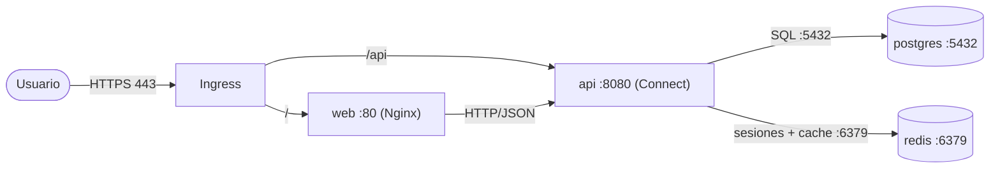
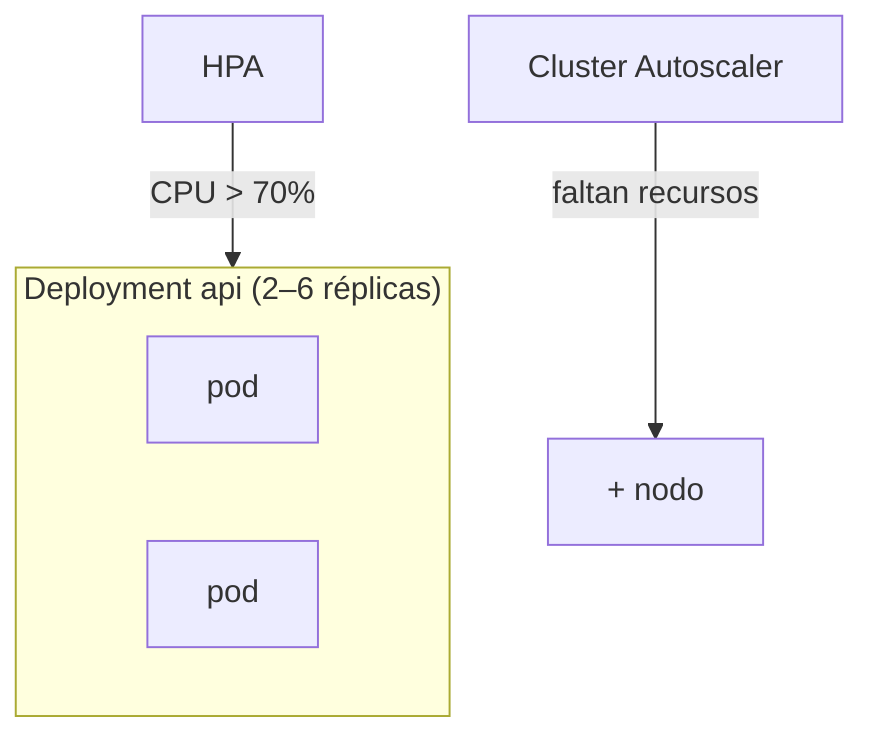

# Contenedores y Kubernetes

Empaquetado de la aplicación y su orquestación en GKE.

## 1. Estrategia de empaquetado

La aplicación se divide en **cuatro contenedores**, uno por responsabilidad:

| Contenedor | Contenido | Imagen base |
|------------|-----------|-------------|
| `web` | Frontend React compilado (Vite), servido por Nginx | `nginx:alpine` |
| `api` | Backend Go (binario único) | `distroless` / `scratch` (multi-stage) |
| `postgres` | Base de datos relacional | `postgres:18-alpine` |
| `redis` | Sesiones y cache de reportes | `redis:7-alpine` |

**Backend: monolito modular, no microservicios.** El backend es un único deployable con módulos internos separados por dominio (`enrollments`, `grades`, `reports`, `users`, `auth`). A esta escala y con un equipo chico, partirlo en microservicios sumaría complejidad de red, despliegue y observabilidad sin beneficio real: misma claridad de dominio, mucho más costo operativo. Los módulos exponen su contrato en Protobuf, así que extraer uno a un servicio aparte —si el volumen lo justifica— es un cambio acotado, no una reescritura.

**Go en imagen mínima.** El binario estático de Go se compila con build multi-stage y corre sobre `distroless`/`scratch`. Resultado: imagen de pocos MB, arranque casi instantáneo y menor superficie de ataque.

**Frontend estático.** React se compila a archivos estáticos con Vite y los sirve Nginx. No hay runtime de Node en producción.

## 2. Comunicación entre servicios

La API usa **Connect** (sobre el ecosistema gRPC). Un mismo puerto atiende gRPC, gRPC-Web y HTTP/JSON, así que el navegador habla con la API por HTTP/JSON sin necesidad de un proxy intermedio.



| Origen | Destino | Puerto | Protocolo |
|--------|---------|--------|-----------|
| Usuario | Ingress | 443 | HTTPS |
| Ingress | web | 80 | HTTP |
| Ingress | api | 8080 | Connect (HTTP/JSON) |
| api | postgres | 5432 | TCP/PostgreSQL |
| api | redis | 6379 | TCP/RESP |

- El frontend solo habla con la API. Los contratos se generan desde los mismos `.proto`, con tipos compartidos cliente-servidor.
- `postgres` y `redis` son `ClusterIP`: no se exponen fuera del cluster.
- El único ingreso externo es el Ingress HTTPS.

**Autenticación.** El login crea una sesión en Redis y devuelve una cookie `httpOnly` con el identificador. En cada petición, un interceptor de la API valida la sesión contra Redis e inyecta el usuario y su rol (admin, docente, alumno). La autorización se evalúa por operación según el rol.

## 3. Objetos de Kubernetes

| Objeto | Recurso | Por qué |
|--------|---------|---------|
| Deployment | `web`, `api`, `redis` | Cargas sin estado, réplicas intercambiables. |
| StatefulSet | `postgres` | Estado e identidad estable; necesita volumen persistente. |
| Service ClusterIP | `api`, `postgres`, `redis` | Comunicación interna. |
| Service headless | `postgres` | Identidad de red estable del StatefulSet. |
| Ingress | HTTPS | Punto de entrada externo con certificado gestionado. |
| ConfigMap | configuración no sensible | URLs, flags, nombre de base. |
| Secret | credenciales | Usuario/clave de base, credenciales de AWS. |
| HPA | `api` | Escala según CPU. |
| PVC | volumen de `postgres` | Persistencia de datos. |
| NetworkPolicy | por namespace | Aísla los ambientes entre sí. |

Estructura de manifiestos (un overlay por ambiente):

```
k8s/
├── base/
│   ├── web-deployment.yaml
│   ├── api-deployment.yaml
│   ├── postgres-statefulset.yaml
│   ├── redis-deployment.yaml
│   ├── services.yaml
│   ├── ingress.yaml
│   ├── configmap.yaml
│   ├── hpa.yaml
│   └── networkpolicy.yaml
└── overlays/
    ├── dev/
    ├── test/
    └── prod/
```

> Los Secrets no se versionan en el repositorio; se crean aparte o se inyectan desde un gestor de secretos.

## 4. Escalado y alta disponibilidad

| Mecanismo | Configuración |
|-----------|---------------|
| Réplicas | `web` y `api` con 2+ réplicas en producción (sin punto único de falla). |
| HPA | `api` escala entre 2 y 6 réplicas al superar 70 % de CPU. |
| Liveness probe | Reinicia el contenedor si deja de responder. |
| Readiness probe | Saca el pod del balanceo hasta que está listo. |
| Autoscaling de nodos | El cluster suma nodos si los pods no entran, con un techo para acotar costo. |

Probes de la API:

```yaml
livenessProbe:
  httpGet: { path: /healthz, port: 8080 }
  initialDelaySeconds: 5
  periodSeconds: 10
readinessProbe:
  httpGet: { path: /readyz, port: 8080 }
  initialDelaySeconds: 3
  periodSeconds: 5
```



## 5. Aislamiento entre ambientes

Cada namespace (dev/test/prod) tiene su propia copia de los cuatro servicios. Las NetworkPolicies impiden el tráfico entre ambientes: la API de dev no puede alcanzar la base de prod. Los Secrets son independientes por namespace.
