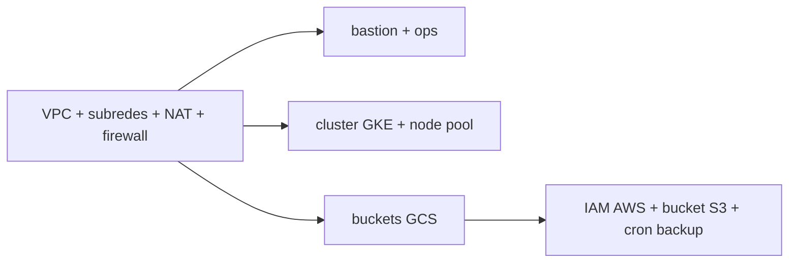
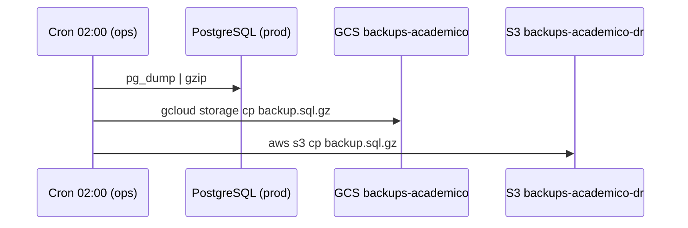

# Infraestructura — Guía de despliegue

Runbook para levantar la infraestructura en GCP (principal) y AWS (respaldo) con Terraform.
Toda la infraestructura es reproducible: se crea con `terraform apply` y se elimina con `terraform destroy`.

> Las capturas de consola se agregan durante la ejecución real (marcadas con `[captura]`).

## 1. Prerrequisitos

| Requisito  | Detalle                                                                                                   |
| ---------- | --------------------------------------------------------------------------------------------------------- |
| Cuenta GCP | Proyecto creado, facturación activa, APIs habilitadas (Compute, Container, Storage, Monitoring, Logging). |
| Cuenta AWS | Usuario IAM con permiso de escritura solo sobre el bucket de backups.                                     |
| Terraform  | >= 1.6                                                                                                    |
| gcloud CLI | Autenticado: `gcloud auth application-default login`                                                      |
| aws CLI    | Configurado: `aws configure` (clave del usuario IAM de backups)                                           |

Habilitar APIs de GCP:

```bash
gcloud services enable \
  compute.googleapis.com \
  container.googleapis.com \
  storage.googleapis.com \
  monitoring.googleapis.com \
  logging.googleapis.com
```

## 2. Estado remoto de Terraform

El estado se guarda en un bucket GCS con versionado (no local). Crear el bucket una sola vez:

```bash
gcloud storage buckets create gs://tfstate-academico \
  --location=us-central1 \
  --uniform-bucket-level-access
gcloud storage buckets update gs://tfstate-academico --versioning
```

Backend en Terraform:

```hcl
terraform {
  backend "gcs" {
    bucket = "tfstate-academico"
    prefix = "infra"
  }
}
```

## 3. Estructura del código IaC

```
infra/
├── backend.tf          # estado remoto (GCS)
├── providers.tf        # google + aws
├── variables.tf
├── network.tf          # VPC, subredes, NAT, firewall
├── vms.tf              # bastion + ops
├── gke.tf              # cluster + node pool
├── storage.tf          # buckets GCS + bucket S3
├── backup.tf           # IAM AWS + cron de la VM ops
└── outputs.tf
```

## 4. Despliegue paso a paso

```bash
cd infra
terraform init      # descarga providers y conecta el backend GCS
terraform plan      # revisar el plan antes de aplicar
terraform apply     # crear la infraestructura
```

Orden de creación (Terraform lo resuelve por dependencias):



## 5. Red y firewall

| Recurso       | Valor                                                  |
| ------------- | ------------------------------------------------------ |
| VPC           | `vpc-academico`                                        |
| subnet-public | `10.0.0.0/24` (bastión)                                |
| subnet-ops    | `10.0.1.0/24` (VM ops)                                 |
| subnet-gke    | `10.0.16.0/20` + rangos secundarios para pods/services |
| Cloud NAT     | salida a internet de subredes privadas                 |

Reglas de firewall (acceso mínimo):

| Regla                 | Origen               | Destino         | Puerto         |
| --------------------- | -------------------- | --------------- | -------------- |
| `allow-ssh-bastion`   | IP del administrador | bastión         | 22             |
| `allow-https-ingress` | Internet             | balanceador GKE | 443            |
| `allow-internal`      | rangos de la VPC     | VPC             | según servicio |

Verificación:

```bash
gcloud compute networks subnets list --network=vpc-academico
gcloud compute firewall-rules list --filter="network=vpc-academico"
```

`[captura]` consola de VPC con subredes y reglas.

## 6. Máquinas virtuales

| VM        | Subred        | Tamaño   | IP pública       | Rol                        |
| --------- | ------------- | -------- | ---------------- | -------------------------- |
| `bastion` | subnet-public | e2-micro | sí (restringida) | Acceso SSH / kubectl       |
| `ops`     | subnet-ops    | e2-small | no               | Cron de backup cross-cloud |

- SO: Debian 12.
- Claves SSH gestionadas por OS Login (sin claves embebidas en metadatos).
- La VM `ops` no tiene IP pública; sale por Cloud NAT.

Verificación:

```bash
gcloud compute instances list
gcloud compute ssh bastion --zone=us-central1-a   # único acceso
```

`[captura]` listado de instancias.

## 7. Almacenamiento

| Tipo   | Recurso                       | Uso                            | Retención                                   |
| ------ | ----------------------------- | ------------------------------ | ------------------------------------------- |
| Bloque | Persistent Disk (pd-balanced) | PVC de PostgreSQL              | snapshots diarios, 7 días                   |
| Objeto | GCS `assets-academico`        | activos estáticos del frontend | —                                           |
| Objeto | GCS `backups-academico`       | backups de la base             | 30 días                                     |
| Objeto | S3 `backups-academico-dr`     | réplica cross-cloud            | versionado + lifecycle a frío a los 30 días |

Política de snapshots de disco:

```bash
gcloud compute resource-policies create snapshot-schedule diario \
  --region=us-central1 \
  --max-retention-days=7 \
  --daily-schedule --start-time=03:00
```

## 8. Pool de conexiones (presupuesto)

La aplicación usa el pool de pgx (`pgxpool`), **uno por instancia**. No se usa un pooler compartido (PgBouncer): a esta escala, con el HPA acotado, alcanza con dimensionar el pool para que el total de conexiones nunca supere `max_connections` de PostgreSQL.

Presupuesto de conexiones:

```
maxReplicas (HPA) × pool_size + reservas ≤ max_connections
```

Las reservas cubren migraciones, la VM `ops`, monitoreo y superusuario. Valores de referencia:

| Parámetro | Valor de referencia |
| --------- | ------------------- |
| `max_connections` (PostgreSQL) | 100 |
| Reservas | ~20 |
| HPA `maxReplicas` | 6 |
| `pool_size` por instancia | 12 |
| Total app (6 × 12) | 72 ≤ 80 ✓ |

Sin pooling por transacción, pgx conserva sus prepared statements (modo por defecto) y la app y las migraciones comparten un **único DSN**.

> Escalón futuro: si no se pudiera acotar la cantidad de clientes (muchos servicios, concurrencia impredecible), se introduce un pooler compartido como PgBouncer. En transaction mode obligaría a `QueryExecModeSimpleProtocol` en pgx y a un DSN directo a Postgres para las migraciones (advisory lock de sesión).

## 9. Backups cross-cloud (GCS → S3)

La VM `ops` ejecuta un cron diario: dump de PostgreSQL, subida a GCS y réplica a S3.



Script (`/opt/backup/backup.sh` en la VM ops):

```bash
#!/usr/bin/env bash
set -euo pipefail
STAMP=$(date +%Y%m%d-%H%M)
FILE="academico-${STAMP}.sql.gz"

# dump desde el pod de postgres en prod
kubectl -n prod exec deploy/api -- pg_dump "$DATABASE_URL" | gzip > "/tmp/${FILE}"

# destino primario (GCS) y réplica cross-cloud (S3)
gcloud storage cp "/tmp/${FILE}" "gs://backups-academico/${FILE}"
aws s3 cp "/tmp/${FILE}" "s3://backups-academico-dr/${FILE}"

rm -f "/tmp/${FILE}"
```

Crontab:

```cron
0 2 * * * /opt/backup/backup.sh >> /var/log/backup.log 2>&1
```

`[captura]` objetos en GCS y en S3 tras la primera corrida.

## 10. Prueba de restauración

Restaurar el último backup en un namespace de prueba y validar:

```bash
# bajar el último backup
aws s3 cp s3://backups-academico-dr/academico-<stamp>.sql.gz .

# restaurar en el postgres de test
gunzip -c academico-<stamp>.sql.gz | \
  kubectl -n test exec -i statefulset/postgres -- psql "$DATABASE_URL"

# validar: conteo de registros clave
kubectl -n test exec statefulset/postgres -- \
  psql "$DATABASE_URL" -c "SELECT count(*) FROM enrollments;"
```

`[captura]` resultado de la consulta de validación.

## 11. Apagado y reducción de costos

Para no consumir crédito fuera de las demos, destruir la infraestructura no productiva:

```bash
terraform destroy            # elimina todo
# o reducir el node pool a cero:
gcloud container clusters resize academico --node-pool=default --num-nodes=0 --zone=us-central1-a
```

El estado en GCS persiste, así que `terraform apply` reconstruye todo idéntico cuando se retoma.
