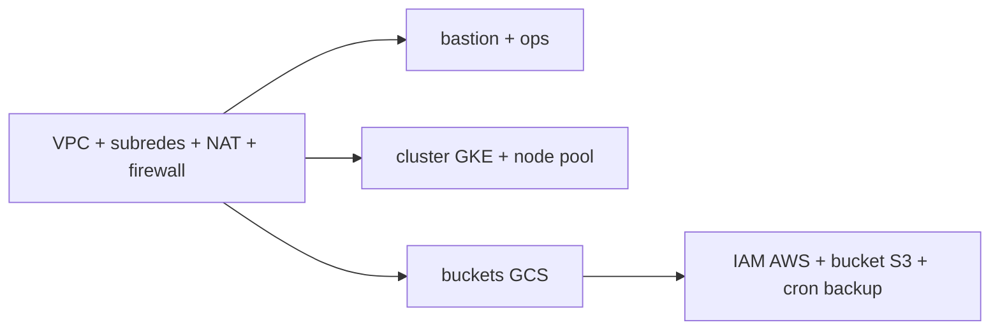
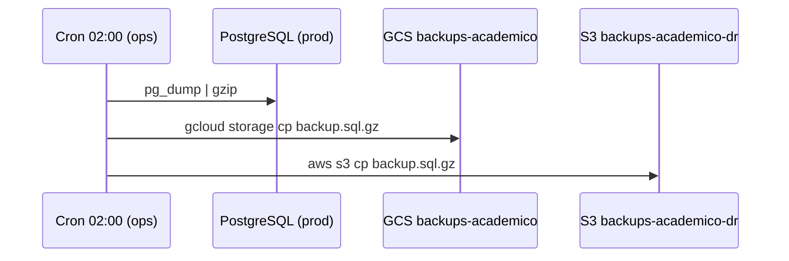

# Guía de despliegue de infraestructura

Diseño, implementación y evidencia de la infraestructura en GCP (principal) y AWS (respaldo) con Terraform. Toda la infraestructura es reproducible: se crea con `terraform apply` y se elimina con `terraform destroy`.

> El procedimiento operativo copy-paste, comando por comando, está en el [runbook de despliegue](../despliegue-cloud/README.md). Este documento cubre el diseño, la estructura y la evidencia.
> Las capturas de consola se agregan durante la ejecución real (marcadas con `[captura]`).

## Índice

1. [Prerrequisitos](#1-prerrequisitos)
2. [Estado remoto de Terraform](#2-estado-remoto-de-terraform)
3. [Estructura del código IaC](#3-estructura-del-código-iac)
4. [Despliegue paso a paso](#4-despliegue-paso-a-paso)
5. [Red y firewall](#5-red-y-firewall)
6. [Máquinas virtuales](#6-máquinas-virtuales)
7. [Almacenamiento](#7-almacenamiento)
8. [Pool de conexiones (presupuesto)](#8-pool-de-conexiones-presupuesto)
9. [Backups cross-cloud (GCS → S3)](#9-backups-cross-cloud-gcs--s3)
10. [Prueba de restauración](#10-prueba-de-restauración)
11. [Apagado y reducción de costos](#11-apagado-y-reducción-de-costos)

## 1. Prerrequisitos

| Requisito  | Detalle                                                                                                   |
| ---------- | --------------------------------------------------------------------------------------------------------- |
| Cuenta GCP | Proyecto creado, facturación activa, APIs habilitadas (Compute, Container, Storage, Monitoring, Logging). |
| Cuenta AWS | Usuario IAM con permiso de escritura solo sobre el bucket de backups.                                     |
| Terraform  | >= 1.6                                                                                                    |
| gcloud CLI | Autenticado: `gcloud auth application-default login`                                                      |
| aws CLI    | Configurado: `aws configure` (clave del usuario IAM de backups)                                           |

Habilitar APIs de GCP:

La lista completa está en `infra/apis.tf`; Terraform las habilita en el `apply`. Para habilitarlas manualmente antes del primer apply:

```bash
gcloud services enable \
  compute.googleapis.com \
  container.googleapis.com \
  storage.googleapis.com \
  monitoring.googleapis.com \
  logging.googleapis.com \
  cloudkms.googleapis.com \
  iam.googleapis.com \
  serviceusage.googleapis.com \
  cloudresourcemanager.googleapis.com \
  artifactregistry.googleapis.com \
  billingbudgets.googleapis.com \
  iap.googleapis.com
```

## 2. Estado remoto de Terraform

El estado se guarda en un bucket GCS con versionado (no local). Crear el bucket una sola vez:

```bash
gcloud storage buckets create gs://tfstate-academico \
  --location=us-central1 \
  --uniform-bucket-level-access
gcloud storage buckets update gs://tfstate-academico --versioning
```

Backend en Terraform:

```hcl
terraform {
  backend "gcs" {
    bucket = "tfstate-academico"
    prefix = "infra"
  }
}
```

## 3. Estructura del código IaC

El detalle archivo por archivo está en [`infra/README.md`](../../infra/README.md) (fuente única). A grandes rasgos: red (VPC/subredes/NAT/firewall), cómputo (`bastion` + `ops`), GKE, almacenamiento (GCS + S3 DR), KMS/IAM (cifrado y permisos), monitoreo, y los scripts de backup/restore.

## 4. Despliegue paso a paso

El procedimiento operativo completo, comando por comando (terraform → imágenes → app en GKE → TLS → backups), está en el runbook copy-paste [`../despliegue-cloud`](../despliegue-cloud/README.md). En resumen, la parte de Terraform:

```bash
cd infra
terraform init      # descarga providers y conecta el backend GCS
terraform plan      # revisar el plan antes de aplicar
terraform apply     # crear la infraestructura
```

Orden de creación (Terraform lo resuelve por dependencias):


```mermaid
flowchart LR
    net["VPC + subredes + NAT + firewall"] --> vms["bastion + ops"]
    net --> gke["cluster GKE + node pool"]
    net --> stor["buckets GCS"]
    stor --> bkp["IAM AWS + bucket S3 + cron backup"]
```

## 5. Red y firewall

| Recurso       | Valor                                                  |
| ------------- | ------------------------------------------------------ |
| VPC           | `vpc-academico`                                        |
| subnet-public | `10.0.0.0/24` (bastión)                                |
| subnet-ops    | `10.0.1.0/24` (VM ops)                                 |
| subnet-gke    | `10.0.16.0/20` + rangos secundarios para pods/services |
| Cloud NAT     | salida a internet de subredes privadas                 |

Reglas de firewall (acceso mínimo):

| Regla                 | Origen               | Destino         | Puerto         |
| --------------------- | -------------------- | --------------- | -------------- |
| `allow-ssh-bastion`   | IP del administrador | bastión         | 22             |
| `allow-iap-ssh-ops`   | IAP `35.235.240.0/20` | ops            | 22             |
| `allow-https-ingress` | Internet             | balanceador GKE | 443            |
| `allow-internal`      | rangos de la VPC     | VPC             | según servicio |

Verificación:

```bash
gcloud compute networks subnets list --network=vpc-academico
gcloud compute firewall-rules list --filter="network=vpc-academico"
```

`[captura]` consola de VPC con subredes y reglas.

## 6. Máquinas virtuales

| VM        | Subred        | Tamaño   | IP pública       | Rol                        |
| --------- | ------------- | -------- | ---------------- | -------------------------- |
| `bastion` | subnet-public | e2-micro | sí (restringida) | Acceso SSH / kubectl       |
| `ops`     | subnet-ops    | e2-small | no               | Cron de backup cross-cloud |

- SO: Debian 12.
- Claves SSH gestionadas por OS Login (sin claves embebidas en metadatos).
- La VM `ops` no tiene IP pública; sale por Cloud NAT.

Verificación:

```bash
gcloud compute instances list
gcloud compute ssh bastion --zone=us-central1-a          # acceso directo (IP pública restringida)
gcloud compute ssh ops --tunnel-through-iap --zone=us-central1-a  # acceso vía IAP TCP forwarding (no pasa por el bastión; habilitado por la regla allow-iap-ssh-ops)
```

`[captura]` listado de instancias.

## 7. Almacenamiento

| Tipo   | Recurso                       | Uso                            | Retención                                   |
| ------ | ----------------------------- | ------------------------------ | ------------------------------------------- |
| Bloque | Persistent Disk (pd-balanced) | PVC de PostgreSQL              | snapshots diarios, 7 días                   |
| Objeto | GCS `assets-academico`        | media subida por usuarios (p. ej. fotos de perfil) | —                                           |
| Objeto | GCS `backups-academico`       | backups de la base             | 30 días                                     |
| Objeto | S3 `backups-academico-dr`     | réplica cross-cloud            | versionado + lifecycle a frío a los 30 días |

Política de snapshots de disco:

```bash
gcloud compute resource-policies create snapshot-schedule diario \
  --region=us-central1 \
  --max-retention-days=7 \
  --daily-schedule --start-time=03:00
```

## 8. Pool de conexiones (presupuesto)

La aplicación usa el pool de pgx (`pgxpool`), **uno por instancia**. No se usa un pooler compartido (PgBouncer): a esta escala, con el HPA acotado, alcanza con dimensionar el pool para que el total de conexiones nunca supere `max_connections` de PostgreSQL.

Presupuesto de conexiones:

```
maxReplicas (HPA) × pool_size + reservas ≤ max_connections
```

Las reservas cubren migraciones, la VM `ops`, monitoreo y superusuario. Valores de referencia:

| Parámetro | Valor de referencia |
| --------- | ------------------- |
| `max_connections` (PostgreSQL) | 100 |
| Reservas | ~20 |
| HPA `maxReplicas` | 6 |
| `pool_size` por instancia | 12 |
| Total app (6 × 12) | 72 ≤ 80 ✓ |

Sin pooling por transacción, pgx conserva sus prepared statements (modo por defecto) y la app y las migraciones comparten un **único DSN**.

> Escalón futuro: si no se pudiera acotar la cantidad de clientes (muchos servicios, concurrencia impredecible), se introduce un pooler compartido como PgBouncer. En transaction mode obligaría a `QueryExecModeSimpleProtocol` en pgx y a un DSN directo a Postgres para las migraciones (advisory lock de sesión).

## 9. Backups cross-cloud (GCS → S3)

La VM `ops` ejecuta un cron diario: dump de PostgreSQL desde el pod `postgres` en el namespace `academico-prod` (vía `kubectl exec`), subida a GCS y réplica a S3. La credencial AWS pertenece al usuario IAM `ops-backup` y se provee fuera de banda; el access key no vive en el state de Terraform.


```mermaid
sequenceDiagram
    participant cron as Cron 02:00 (ops)
    participant pg as PostgreSQL (prod)
    participant gcs as GCS backups-academico
    participant s3 as S3 backups-academico-dr

    cron->>pg: pg_dump | gzip
    cron->>gcs: gcloud storage cp backup.sql.gz
    cron->>s3: aws s3 cp backup.sql.gz
```

El script de backup está en `infra/scripts/backup.sh`. Se instala en la VM ops como `/opt/backup/backup.sh` mediante el startup script de Terraform (`infra/scripts/ops-startup.sh.tftpl`). Lee la configuración desde `/etc/default/academico-backup` y escribe logs en `/var/log/academico-backup.log`.

Crontab (`/etc/cron.d/academico-backup`):

```cron
0 2 * * * root . /etc/default/academico-backup && /opt/backup/backup.sh >> /var/log/academico-backup.log 2>&1
```

`[captura]` objetos en GCS y en S3 tras la primera corrida.

## 10. Prueba de restauración

El script de restauración está en `infra/scripts/restore.sh`. Se instala en la VM ops como `/opt/backup/restore.sh`. Descarga desde S3 (valida la copia DR), restaura en el namespace `academico-test` y ejecuta una consulta de validación (`SELECT count(*) FROM enrollments`) como evidencia de RNF-5. Con `BACKUP_OBJECT=latest` resuelve automáticamente el objeto más reciente.

> Prerrequisito: el overlay `test` debe estar desplegado (`kubectl apply -k k8s/overlays/test` desde el bastión — namespace `academico-test` con su propio postgres). El restore se prueba ahí para no tocar prod.

```bash
# Ejecutar en la VM ops
BACKUP_OBJECT=latest S3_BUCKET=backups-academico-dr-<suffix> TARGET_NAMESPACE=academico-test \
  /opt/backup/restore.sh
```

`[captura]` resultado de la consulta de validación.

## 11. Apagado y reducción de costos

Para no consumir crédito fuera de las demos, destruir los recursos de cómputo con `-target`:

```bash
# Destruir solo cómputo (evita los prevent_destroy en KMS y bucket de backups)
terraform destroy \
  -target=google_container_node_pool.primary \
  -target=google_container_cluster.primary \
  -target=google_compute_instance.bastion \
  -target=google_compute_instance.ops \
  -target=google_compute_router_nat.nat \
  -target=google_compute_address.bastion

# o reducir el node pool a cero sin destruir el cluster:
gcloud container clusters resize academico --node-pool=default --num-nodes=0 --zone=us-central1-a
```

> `terraform destroy` completo falla por los `prevent_destroy` configurados en las claves KMS (que además no se pueden borrar en GCP) y en el bucket de backups. El destroy con `-target` elimina solo el cómputo; red, IAM, KMS y buckets permanecen. `terraform apply` reconstruye el cómputo idéntico cuando se retoma.
