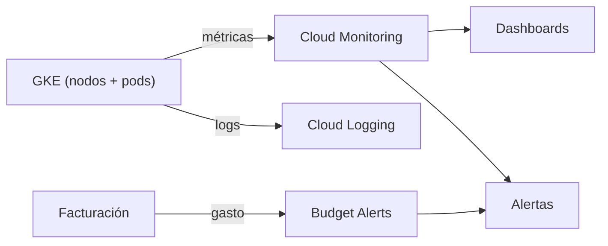

# Monitoreo y costos

Observabilidad con Cloud Monitoring + Cloud Logging, y estimación de costos con su plan de optimización.

## 1. Stack de observabilidad

| Herramienta | Uso |
|-------------|-----|
| Cloud Monitoring | Métricas de nodos, pods y aplicación; dashboards; alertas. |
| Cloud Logging | Logs centralizados de aplicación y auditoría (accesos, cambios de configuración). |
| Budget Alerts | Alertas de costo sobre la facturación del proyecto. |

Se eligió la observabilidad nativa de GCP en lugar de desplegar un stack propio: no consume recursos del cluster y las métricas de GKE y el tablero de costos quedan disponibles sin instalar nada.

## 2. Dashboards

| Dashboard | Métricas |
|-----------|----------|
| Infraestructura | CPU, memoria y disco de los nodos del cluster. |
| Aplicación | Latencia, tasa de peticiones, errores y pods listos de la API. |
| Costos | Gasto diario y mensual por servicio. |

`[captura]` los tres dashboards en consola.

## 3. Alertas

| Alerta | Condición | Para qué |
|--------|-----------|----------|
| CPU alta | Uso de CPU sostenido > 70 % | Anticipar saturación antes de degradar el servicio. |
| Caída de servicio | Uptime check al endpoint de la app falla | Detectar indisponibilidad apenas ocurre. |
| Costo | Gasto del mes supera el umbral definido | Evitar sorpresas de facturación. |

`[captura]` las tres alertas configuradas y un disparo de prueba.

## 4. Estimación de costos

Región `us-central1`. Estimación mensual preliminar, ejecutando 24/7. Las cifras por servicio se validan con las calculadoras oficiales: [GCP Pricing Calculator](https://cloud.google.com/products/calculator) y [AWS Pricing Calculator](https://calculator.aws).

### GCP (nube principal)

| Servicio | 24/7 (USD/mes) |
|----------|----------------|
| Plano de control GKE (zonal) | 0 (primer cluster zonal sin cargo) |
| 2× nodos `e2-medium` | ~49 |
| VM `bastion` (`e2-micro`) | ~6 |
| VM `ops` (`e2-small`) | ~12 |
| Cloud Load Balancing (Ingress) | ~18 |
| Persistent Disk (20 GB) | ~2 |
| Cloud NAT | ~32 |
| Cloud Storage (GCS) | ~1 |
| Egress hacia AWS (backups) | ~2 |
| Cloud Monitoring + Logging | 0 (dentro de cuota gratuita) |
| **Subtotal GCP** | **~122** |

### AWS (nube de respaldo)

| Servicio | 24/7 (USD/mes) |
|----------|----------------|
| S3 (backups, pocos GB + versionado) | ~1 |
| **Subtotal AWS** | **~1** |

### Total

| | USD/mes |
|--|--------|
| **Total 24/7** | **~123** |
| **Con apagado (~20 h/semana)** | **~15–30** |

El mayor factor de costo no es el tamaño de los recursos, sino el **tiempo encendido**. Como la infraestructura es reproducible con Terraform, fuera de las ventanas de desarrollo y demo se destruye o se escala a cero.

## 5. Optimización de costos

| Acción | Impacto |
|--------|---------|
| **Nodos spot/preemptibles** | 60–80 % menos en cómputo, el rubro más caro. |
| **Apagar entornos no productivos** | `terraform destroy` o escalar el node pool a cero fuera de horario. Es el mayor ahorro. |
| **HPA + autoscaling de nodos con techo** | Escalar según demanda real en vez de sobre-aprovisionar; el techo acota el gasto máximo. |
| Bastión en free tier | Una VM `e2-micro` entra en la capa gratuita. |
| Ingress único | Un solo balanceador compartido en vez de uno por servicio. |
| Lifecycle en S3 | Backups viejos pasan a almacenamiento frío automáticamente. |

Las tres primeras son las de mayor impacto y mantienen los SLA: el escalado responde a la demanda y el apagado solo afecta entornos no productivos.
