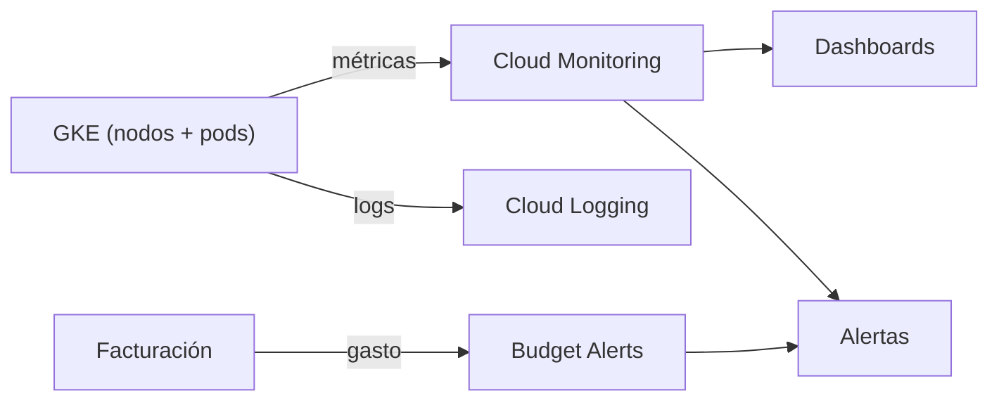

# Monitoreo y costos

Observabilidad con Cloud Monitoring + Cloud Logging, y estimación de costos con su plan de optimización.

## Índice

1. [Stack de observabilidad](#1-stack-de-observabilidad)
2. [Dashboards](#2-dashboards)
3. [Alertas](#3-alertas)
4. [Estimación de costos](#4-estimación-de-costos)
5. [Optimización de costos](#5-optimización-de-costos)

## 1. Stack de observabilidad

| Herramienta | Uso |
|-------------|-----|
| Cloud Monitoring | Métricas de nodos, pods y aplicación; dashboards; alertas. |
| Cloud Logging | Logs centralizados de aplicación y auditoría (accesos, cambios de configuración). |
| Budget Alerts | Alertas de costo sobre la facturación del proyecto. |

Se eligió la observabilidad nativa de GCP en lugar de desplegar un stack propio: no consume recursos del cluster y las métricas de GKE y el tablero de costos quedan disponibles sin instalar nada.

```mermaid
flowchart LR
    gke["GKE (nodos + pods)"] -->|métricas| mon["Cloud Monitoring"]
    gke -->|logs| log["Cloud Logging"]
    bill["Facturación"] -->|gasto| bud["Budget Alerts"]
    mon --> dash["Dashboards"]
    mon --> alert["Alertas"]
    bud --> alert
```

## 2. Dashboards

| Dashboard | Métricas |
|-----------|----------|
| Infraestructura | CPU, memoria y disco de los nodos del cluster. |
| Aplicación | Latencia, tasa de peticiones, errores y pods listos de la API. |
| Costos | Gasto diario y mensual por servicio. |

`[captura]` los tres dashboards en consola.

## 3. Alertas

| Alerta | Condición | Para qué |
|--------|-----------|----------|
| CPU alta | Uso de CPU sostenido > 70 % | Anticipar saturación antes de degradar el servicio. |
| Caída de servicio | 2 o más ubicaciones de prober fallan el uptime check a `/healthz` | Detectar indisponibilidad apenas ocurre. |
| Costo | Gasto del mes supera el umbral definido | Evitar sorpresas de facturación. |

`[captura]` las tres alertas configuradas y un disparo de prueba.

> La alerta de tasa de error RPC (`rpc_error_rate`) está gateada con la variable `enable_app_metric_alerts` (default `false`). Se activa recién cuando la aplicación ya emitió esa métrica personalizada; ver el procedimiento de activación en la guía de despliegue §6.1.

> La alerta de costo se evalúa sobre el gasto **mensual** del proyecto (GCP Budget Alerts), alineada con el alcance del proyecto (alarma de costos mensuales). La visibilidad del gasto diario queda cubierta por el dashboard de Costos (§2), que desglosa gasto diario y mensual por servicio.

## 4. Estimación de costos

Región `us-central1`, precios de lista on-demand, mes de 730 horas, ejecución 24/7. Cifras derivadas de los recursos aprovisionados por Terraform y validadas con las calculadoras oficiales: [GCP Pricing Calculator](https://cloud.google.com/products/calculator) y [AWS Pricing Calculator](https://calculator.aws). El node pool autoescala de 2 a 4 nodos: se reporta el baseline (2 nodos) y, entre paréntesis, el pico sostenido (4 nodos).

### GCP (nube principal)

| Servicio | Especificación | USD/mes (24/7) |
|----------|----------------|----------------|
| Plano de control GKE (zonal, Standard) | 1 cluster zonal; fee de $0,10/h cubierto por el crédito mensual de $74,40 por cuenta | ~0 |
| Nodos `e2-medium` (autoscala 2→4) | 2 vCPU / 4 GB c/u | ~49 (pico: ~98) |
| Discos de arranque de nodos | 2–4 × 50 GB pd-balanced (CMEK) | ~10 (pico: ~20) |
| VM `bastion` (`e2-micro`) | + ~10 GB disco; elegible para free tier | ~6 |
| VM `ops` (`e2-small`) | + ~10 GB disco | ~13 |
| IPs externas estáticas | bastion + balanceador (2 × $0,005/h) | ~7 |
| Cloud NAT | 1 gateway ($0,044/h) + datos procesados | ~33 |
| Cloud Load Balancing | Ingress nginx → 1 regla de reenvío + datos | ~18 |
| Persistent Disk — Postgres prod | 20 GB pd-balanced | ~2 |
| PVC dev/test + snapshots diarias de VM | 2 × 1 GB + snapshots incrementales | ~1 |
| Cloud Storage (GCS) | assets + backups (ret. 30 d) + tfstate | ~1 |
| Artifact Registry | imágenes Docker (~5 GB, CMEK) | ~1 |
| Cloud KMS | 3 claves CMEK (etcd, discos de nodo, storage) | ~1 |
| Egress GCP → AWS | backups diarios cross-cloud | ~2 |
| Cloud Monitoring + Logging | GMP; mayormente dentro de la cuota gratuita | ~0–5 |
| **Subtotal GCP — baseline (2 nodos)** | | **~147** |
| **Subtotal GCP — pico sostenido (4 nodos)** | | **~206** |

### AWS (nube de respaldo)

| Servicio | Especificación | USD/mes (24/7) |
|----------|----------------|----------------|
| S3 — backups DR | Standard → Glacier a los 30 d, versionado, pocos GB | ~1 |
| IAM `ops-backup` | usuario con permisos acotados al bucket | 0 |
| **Subtotal AWS** | | **~1** |

### Total

| | USD/mes |
|--|--------|
| **Total 24/7 — baseline (2 nodos)** | **~148** |
| **Total 24/7 — pico sostenido (4 nodos)** | **~207** |
| **Con apagado de cómputo fuera de ventanas** | **~20–35** (persisten solo discos, IPs y almacenamiento) |

El mayor factor de costo no es el tamaño de los recursos, sino el **tiempo encendido**: cómputo (nodos + VMs) concentra cerca de dos tercios de la factura. Como la infraestructura es reproducible con Terraform, fuera de las ventanas de desarrollo y demo se destruye o se escala a cero, dejando solo el almacenamiento persistente.

> **Presupuesto configurado en Terraform:** el presupuesto real configurado vía `billingbudgets` usa la variable `monthly_budget_clp` (default 150.000 CLP ≈ 160 USD a ~940 CLP/USD), con umbrales de alerta al 50 %, 90 % y 100 % del monto mensual. El baseline de ~148 USD/mes queda dentro de ese presupuesto; el pico sostenido lo superaría, lo que justifica el techo de 4 nodos y el apagado fuera de ventanas. Las alertas de budget operan sobre el valor en CLP, no sobre los USD de la estimación.

## 5. Optimización de costos

| Acción | Impacto |
|--------|---------|
| **Nodos spot/preemptibles** | 60–80 % menos en cómputo, el rubro más caro. |
| **Apagar entornos no productivos** | `terraform destroy` o escalar el node pool a cero fuera de horario. Es el mayor ahorro. |
| **HPA + autoscaling de nodos con techo** | Escalar según demanda real en vez de sobre-aprovisionar; el techo acota el gasto máximo. |
| Bastión en free tier | Una VM `e2-micro` entra en la capa gratuita. |
| Ingress único | Un solo balanceador compartido en vez de uno por servicio. |
| Lifecycle en S3 | Backups viejos pasan a almacenamiento frío automáticamente. |

Las tres primeras son las de mayor impacto y mantienen los SLA: el escalado responde a la demanda y el apagado solo afecta entornos no productivos.
